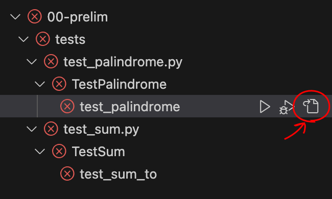
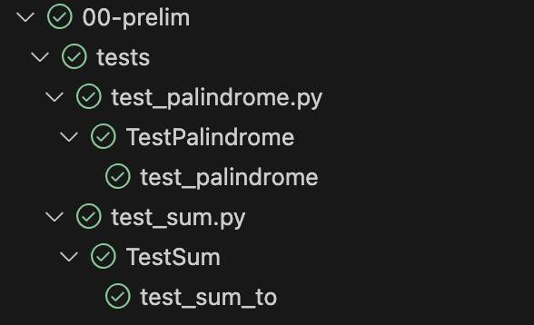

# Lab 00: Logistics

## Goals

After successfully completing this assignment, you should be able to:

- accept GitHub Classroom invitations
- clone assignment repositories
- locate and work on assignment source files
- run included tests and and interpret their output
- commit and submit (push) your work

## Overview

This assignment is primarily designed to help guide you through the steps you must follow to accept, work on, test, and submit assignments. You will follow the same steps for each subsequent assignment, so it's important that you understand them well --- be sure to ask for help if you're unclear on how to perform any step, or *why* you're doing it!

## Accepting assignments

We will use a platform called GitHub Classroom to distribute and collect all assignments. The first step in accessing each assignment is to accept the corresponding GitHub Classroom invitation; you will find a separate invitation link for each assignment on the [class website](https://moss.cs.iit.edu/cs331).  If you're reading this writeup, you already accepted the first assignment via a new or pre-existing account on GitHub. You should also have picked your Hawk username from a list --- you will not need to do this again, as GitHub Classroom will have permanently associated your GitHub account with your Hawk username.

After you accept the invitation, GitHub Classroom creates a copy (known as a *clone*) of the assignment files and places them in a private *Git repository* hosted on GitHub for you. Take some time to check out the homepage of the repository on GitHub --- its URL will look something like `https://github.com/cs331ds/labXX-USER` (where *XX* is the assignment number and *USER* is your GitHub username).

Up top is a list of all files found in the repository, and the contents of the `README.md` file --- which functions as the assignment writeup --- will be displayed under that list. The GitHub web interface allows you to edit files directly in the browser, but we strongly recommend that you do not do so (at least until you're sure what the ramifications are for doing so). Instead, you should create a clone of the repository on your own computer and edit them there. We'll start this process in the next section.

## Cloning assignment repositories

Let's get the assignment files onto your computer so you can work on them. To assist in this, we recommend that you first download and install [Microsoft Visual Studio Code (aka VSCode)](https://code.visualstudio.com), as it simplifies the process. (If you're already familiar with GitHub and Git, and prefer a different editor / integrated development environment (IDE), feel free to clone the repository directly and open the files using your tool of choice.) Once you have VSCode installed, find and click on the blue "Microsoft Visual Studio Code" button on your repository homepage. This should automatically launch VSCode, which, possibly after asking you to authenticate with GitHub, will create a *local clone* of your assignment repository from GitHub. 

## Assignment files

Every assignment repository will consist, at minimum, of the following files / file types:

- `README.md`: This is the assignment writeup (you're reading the lab00 writeup right now). This will typically include specifications for all the exercises that make up the assignment, along with additional information, hints, references, etc. If you right-click on `README.md` in the VSCode file explorer and select "Open Preview", you can view a nicely formatted version of the writeup. 

- Source files: At the top-level (i.e., not contained in sub-directories) of the repository, you will find one or more Python source files (ending with the `.py` extension). You will edit these files to add your own code. Typically, **these are the only files you need to modify in each assignment.**

- Test files: Under the `test` sub-directory, we provide tests that will help you evaluate the correctness of your implementation(s). We'll go over how to run and interpret the output of these tests later.

- Configuration files: In the "hidden" directories `.github`, `.vscode`, and others, we include files used to configure tests and backend submission. Feel free to open them, but **do not alter their contents!** Doing so may mess up the automated grading workflow and test setup.

Each assignment consists of one or more exercises, each of which requires you to add code to corresponding source files. Consider, for instance, the following two exercise specifications (please resist the urge to complete them right away):

---

### Exercise 1 (5 points)

Edit `palindrome.py` so that the function `my_palindrome` returns a **palindrome** of at least 3 letters in length. A palindrome is a string that reads the same backwards as forwards.

### Exercise 2 (5 points)

Edit `sum.py` so that the function `sum_to`, which accepts an integer parameter $k$, returns the sum of the integers 0 up to $k$ (inclusive). E.g., `sum_to(5)` should return the value $0+1+2+3+4+5=15$.

---

If you open the files `palindrome.py` and `sum.py`, you will find that the functions described in the exercises have already been defined for you, but with "stubs" for bodies (typically, just the keyword `pass`). The functions start with [docstrings](https://docs.python.org/3/tutorial/controlflow.html#documentation-strings) that specify their behavior, and often have [type annotations](https://docs.python.org/3/tutorial/controlflow.html#function-annotations). Instead of just duplicating specifications found in the source files, exercises will often just point you at which functions to implement and refer you to source file documentation.

## Running tests

Before working on the exercises, let's see how to test them. In the "Testing" pane of the VSCode Side Bar, you should find a list of all the tests that have been defined for you (you may need to expand the group). Click on the "Run Tests" icon (which looks like: ▶️) at the top of the "Testing" pane to run all tests; you can also click on sub-groups to run just those tests. The tests should fail (since we haven't implemented anything yet) and be marked by ❌'s. Click on the "Show Output" icon to see the test results, which will look something like the following:

    Run completed, parsing output
    ./tests/test_palindrome.py::TestPalindrome::test_palindrome Failed: [undefined]AssertionError: Must return a string
    assert False
    +  where False = isinstance(None, str)
    self = <tests.test_palindrome.TestPalindrome object at 0x103bbb790>

        def test_palindrome(self):
            pal = palindrome.my_palindrome()
    >       assert isinstance(pal, str), 'Must return a string'
    E       AssertionError: Must return a string
    E       assert False
    E        +  where False = isinstance(None, str)

    tests/test_palindrome.py:7: AssertionError

    ./tests/test_sum.py::TestSum::test_sum_to Failed: [undefined]assert None == 15
    +  where None = <function sum_to at 0x103bfe8e0>(5)
    +    where <function sum_to at 0x103bfe8e0> = sum.sum_to
    self = <tests.test_sum.TestSum object at 0x103c03bd0>

        def test_sum_to(self):
    >       assert sum.sum_to(5) == 15
    E       assert None == 15
    E        +  where None = <function sum_to at 0x103bfe8e0>(5)
    E        +    where <function sum_to at 0x103bfe8e0> = sum.sum_to

    tests/test_sum.py:6: AssertionError

    Total number of tests expected to run: 2
    Total number of tests run: 2
    Total number of tests passed: 0
    Total number of tests failed: 2
    Total number of tests failed with errors: 0
    Total number of tests skipped: 0
    Total number of tests with no result data: 0
    Finished running tests!

That's a lot of output! With a bit of practice, however, you should be able to hone in on the important information. In this case, they are:

1. 2 tests ran, 0 tests passed, 2 tests failed (see the summary at the bottom)
2. The `test_palindrome` test failed with the message `"Must return a string"`
3. The `test_sum_to` test failed the assertion `sum.sum_to(5) == 15`
4. For both of the above tests, the function being tested returned the value `None` (that's because functions that just `pass`, as both `my_palindrome` and `sum_to` currently do, effectively return `None`).

Note that the report also shows you the relevant lines in the test functions that fail. An easier way to get to the test functions is to drill down to the failing tests in the "Testing" pane (pictured below) and click on the "Go to Source" icon next to the test name. This will open the corresponding test file in the editor, with the cursor positioned at the failing assertion. 

Reading the test functions should give you a good idea of what the tests are checking for, and how your implementation should behave. For instance, the `test_palindrome` function, which is defined in `tests/test_palindrome.py`, looks like this:

    def test_palindrome(self):
        pal = palindrome.my_palindrome()
        assert isinstance(pal, str), 'Must return a string'
        assert pal.strip() != '', 'String should not be empty'
        assert len(pal) >= 3, 'String should be at least 3 letters long'
        assert pal == pal[::-1], 'String is not a palindrome'

The first assertion checks that the return value of `my_palindrome` is a string. The second assertion checks that the string is not empty. The third assertion checks that the string is at least 3 letters long. The fourth assertion checks that the string is a palindrome. If any of these assertions fail, the test fails.

You should **not** alter any of the tests! Doing so may mislead you into believing that you correctly solved an exercise, when in fact you just changed the test to accept your incorrect implementation. (It also won't work to sneakily "pass" tests by altering them, as we'll be using the original tests on our end to grade your submissions.)

## Committing your work

Ok, now go ahead and implement your solutions to the exercises! (If you're still not quite comfortable with Python syntax, you can check out the [included sample solutions](#solutions)). As you work on your solutions, you can periodically run the tests to help you check your work. Once all the ❌'s turn into ✅'s, as shown below, you're done! 

The test output should look like this:

    Total number of tests expected to run: 2
    Total number of tests run: 2
    Total number of tests passed: 2
    Total number of tests failed: 0
    Total number of tests failed with errors: 0
    Total number of tests skipped: 0
    Total number of tests with no result data: 0
    Finished running tests!

When you're satisfied with your work, you should *commit* it to your repository. What this does is save a snapshot of the changes you made to the code. To do this, go to the "Source Control" pane in the VSCode Side Bar. You should see a list of all the files that have changed since the last commit. Hover over the `palindromes.py` and `sum.py` files and click the "+" icon to stage them for commit. Next, enter a commit message (something like "Finished lab00" will do) and click on the blue "Commit" button.

As you work on future assignments, you should commit your work frequently. This will help you keep track of your progress, and will also make it easier to revert to a previous version of your code if you subsequently make a mistake. Using meaningful commit messages will help you keep track of what you were working on at each step of the way.

## Submitting (Pushing) your work 

It is important to understand that just committing changes to your local repository *does not mean that we can see your work*! To make your work visible to us, you need to *push* your commits to the repository hosted on GitHub. 

To push your commits to GitHub, click on the "..." icon in the "Source Control" pane and select "Push". When the operation completes, you can verify its success by going to the "Commits" tab on your GitHub repository page. You should see a list of commits with the most recent one at the top. If you click on the commit message, you should see the changes you made to the code. Again, keep in mind that your GitHub repository page reflects the state of your code that is visible to us (for grading/feedback). If you don't see your changes on GitHub, we won't be able to either!

You may push more commits to GitHub as often as you like. We will only grade the last commit that you push before the deadline.

And that's it! If your latest commit pushed to GitHub successfully passes all the tests, you've earned full points for both exercises and are done with the assignment. If not, you can keep working on it while committing and pushing your changes to GitHub until you're satisfied.

## Summary

Here's a recap of the steps you need to follow to complete an assignment:

1. Accept the assignment invitation link found on the class website
2. Clone the repository to your computer (via VSCode)
3. Refer to the writeup (`README.md`) for exercise specifications
4. Edit source files to solve the exercises
5. Run included tests to check your work
6. Commit your work to your local repository 
7. Push your commits to GitHub (repeat steps 3-7 as needed)

## Solutions 

Here are sample solutions to the exercises. We include them for this assignment because the focus is on logistics, and you may still be busy learning Python syntax. No sample solutions in future assignments!

### `palindrome.py`

    def my_palindrome() -> str:
        return 'racecar'

### `sum.py`

    def sum_to(k: int) -> int:
        res = 0
        for i in range(1, k+1): # note: ranges are exclusive of the end
            res += i
        return res
